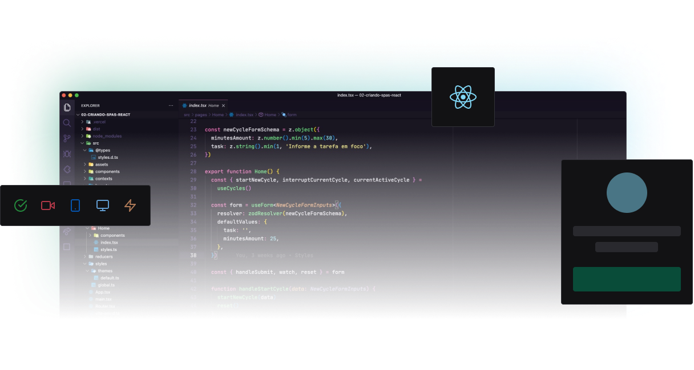

  

<h3 align="center">
    Sistema plataforma de eventos
</h3>
 
<h4 align="center">
	🚧   Concluído 🚀 🚧
</h4>

  
  
  

 

As seguintes ferramentas foram usadas na construção do projeto:

- **[ReactJS](https://pt-br.reactjs.org/)**
- **[Vite](https://vitejs.dev/)**
- **[Typescript](https://www.typescriptlang.org/)**
- **[Apollo](https://www.apollographql.com/)**
- **[GraphQL](https://graphql.org/)**
- **[VimeJS](https://vimejs.com/)**
- **[Phosphor Icons](https://phosphoricons.com/)**
- **[TailwindCSS](https://tailwindcss.com/)**
- **[Date-fns](https://date-fns.org/)**

## Publicação
---
Link para visualização do site via [Vercel](https://guilhermerisu-ignite.vercel.app) 
